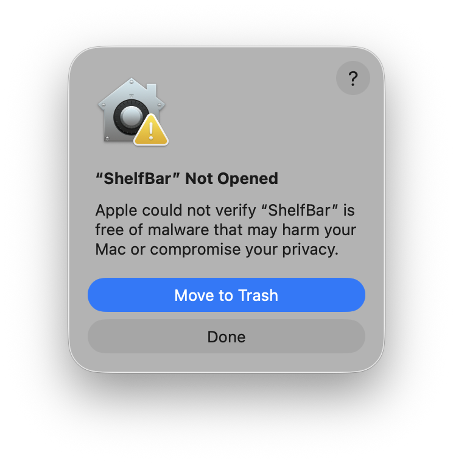

# ShelfBar

Your Touch Bar, Your Workflow.

Turn your MacBook Touch Bar into a smart file shelf.

[](https://github.com/chenyouxiang0810-gif/ShelfBar/releases/tag/v1.0.0-beta.1)
[](https://github.com/chenyouxiang0810-gif/ShelfBar/releases/tag/v1.0.0-beta.1)
[](LICENSE)

[View GitHub Pages →](https://chenyouxiang0810-gif.github.io/ShelfBar/)

ShelfBar is a native macOS AppKit utility for Intel MacBook Pro models with Touch Bar. Drop files, images, text and URLs into a Touch Bar shelf, organize them into stacks, and drag files back out to Finder when you need them.

> Current beta note: ShelfBar uses private Touch Bar APIs and requires an Intel Mac with a physical Touch Bar for the full experience.

## Features

<p align="center">
  
</p>

### Touch Bar Drop Zone

- Universal Drop
- AirDrop Zone
- Drop files
- Drop images
- Drop text
- Drop URLs

<p align="center">
  
</p>

### Touch Bar Shelf

- Folder Stack
- Nested Stack
- Native macOS Icons
- Drag Back Out
- Dock-like Reordering
- Smooth Touch Drag

## Why ShelfBar?

- ✓ Universal Drop
- ✓ Folder Stack
- ✓ Nested Stack
- ✓ Native Finder Icons
- ✓ QuickLook Thumbnail
- ✓ AirDrop Zone
- ✓ Dock-like Drag
- ✓ Floating Shelf Button
- ✓ Touch Bar Animation
- ✓ Menu Bar Mode
- ✓ Auto Hide Dock
- ✓ Light / Dark Theme
- ✓ Drag Back Out
- ✓ MouseBridge
- ✓ Temporary Item Cleanup

## Installation

1. Download `ShelfBar.dmg` from the latest GitHub Release.
2. Open the DMG.
3. Drag `ShelfBar.app` to Applications.
4. Launch ShelfBar.

Release assets prepared locally:

- App: `build/Release/ShelfBar.app`
- DMG: `build/Release/ShelfBar.dmg`
- ZIP: `build/Release/ShelfBar.zip`
- SHA256: `build/Release/SHA256SUMS.txt`

## Supported Macs

ShelfBar is designed for:

- Intel MacBook Pro with physical Touch Bar
- macOS 15.7 or later

Apple Silicon Macs without Touch Bar can run the app window and settings UI, but cannot validate the physical Touch Bar experience.

## Homebrew

Homebrew Cask support is prepared, but not submitted to the official Homebrew cask repository yet.

Local cask draft:

```text
Packaging/homebrew/shelfbar.rb
```

Once the public GitHub Release URL is final, the cask URL and SHA can be submitted or used in a custom tap.

## Project layout

```text
README.md
LICENSE
CHANGELOG.md
docs/
Marketing/
Research/
Packaging/
```

## Download statistics

After publishing on GitHub, these built-in stats are available:

- GitHub Release Download Count: visible per asset in each GitHub Release.
- GitHub Traffic: repository Insights → Traffic.
- GitHub Clones: repository Insights → Traffic → Clones.
- GitHub Views: repository Insights → Traffic → Views.

For better public analytics:

- GitHub Pages + Cloudflare Web Analytics
- GitHub Pages + Plausible

Both avoid adding heavy analytics scripts to the app itself.

## Troubleshooting

### macOS says:

> "ShelfBar" cannot be verified.



This is expected for the current beta because the app has not yet been Apple notarized.

To open it:

1. Open System Settings.
2. Go to Privacy & Security.
3. Find the ShelfBar warning.
4. Click Open Anyway.

Alternative terminal command:

```bash
xattr -dr com.apple.quarantine /Applications/ShelfBar.app
```

Only use this command if you downloaded ShelfBar from the official GitHub Release.

### Why does this warning appear?

This local build has not been Developer ID signed, notarized and stapled by Apple. A future public release should use:

- Developer ID Application signing
- Apple notarization
- stapled app / DMG tickets

## Current public beta limitations

- Intel Touch Bar required for the real Shelf experience.
- Uses private Touch Bar APIs; App Store distribution is not expected.
- Current beta is not notarized on this machine because no Developer ID Application certificate or notarization credentials were available.
- Homebrew Cask is prepared, not submitted.
- GitHub Pages is prepared under `docs/`, not published until the repository is created and Pages is enabled.
